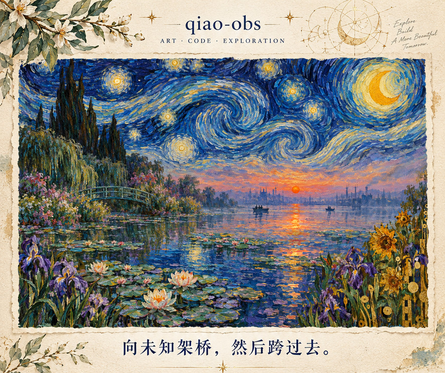
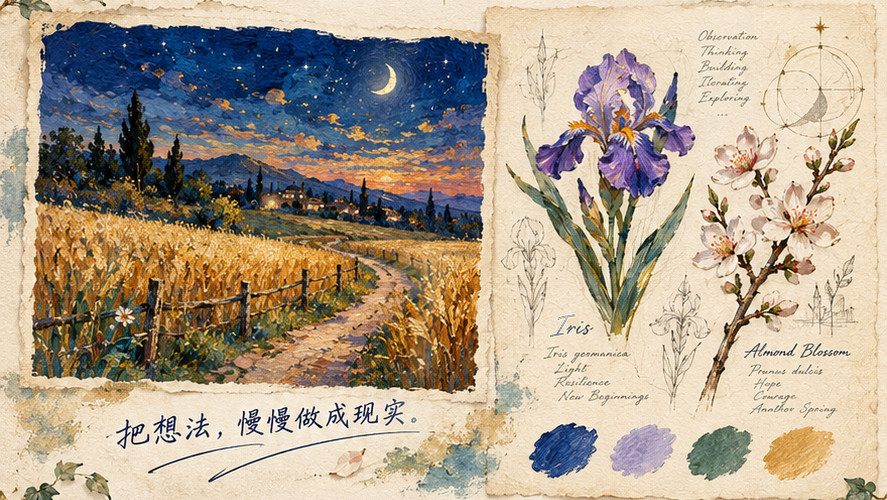
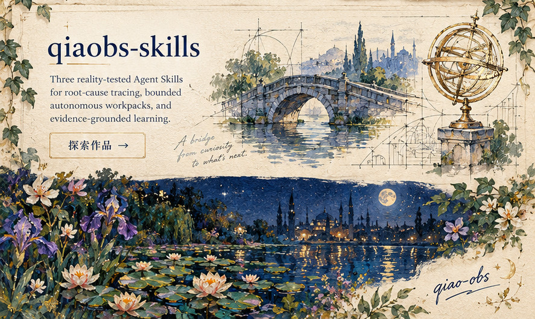
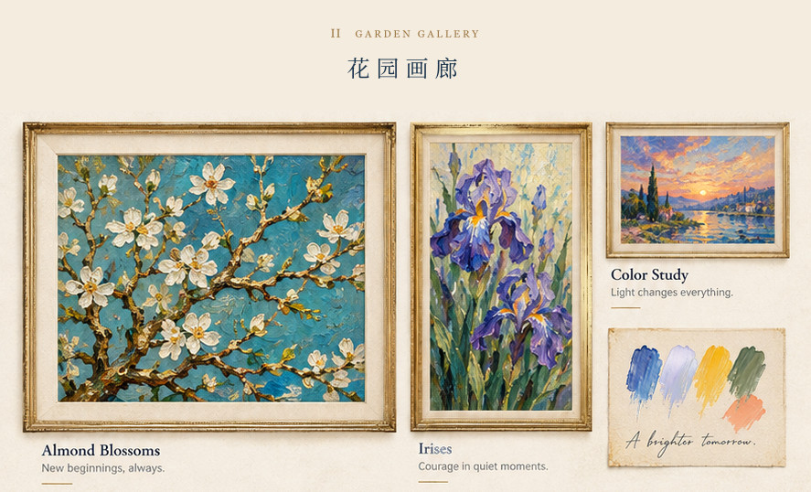
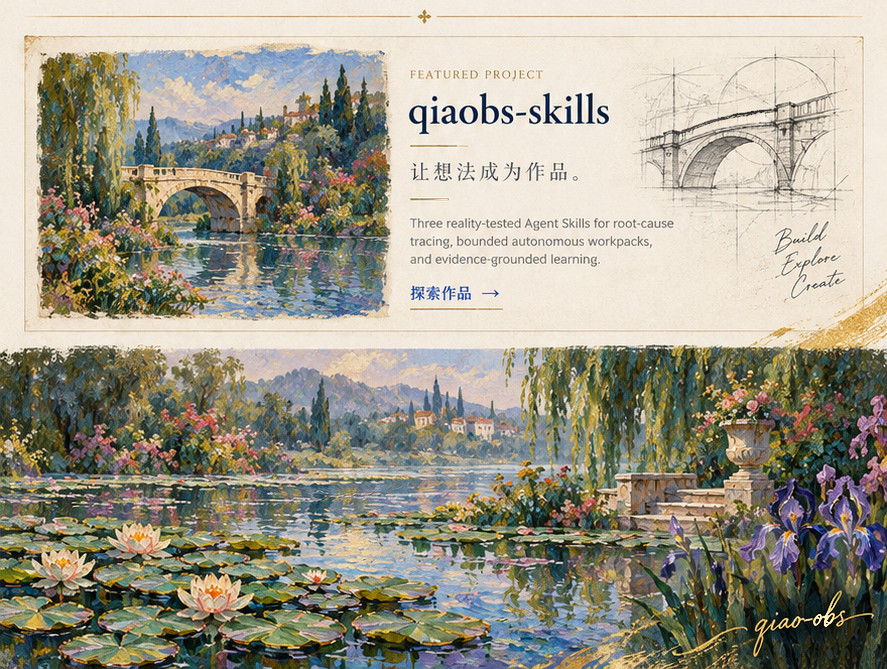
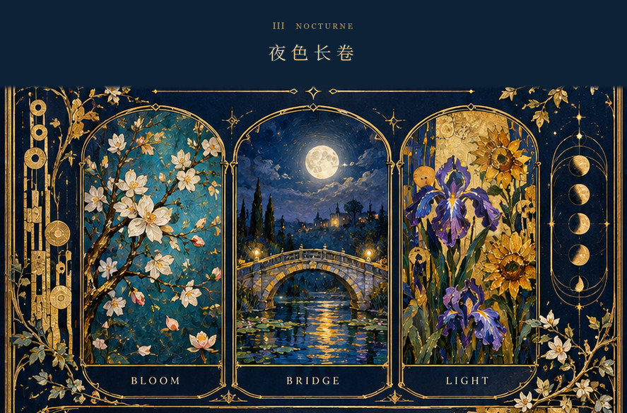
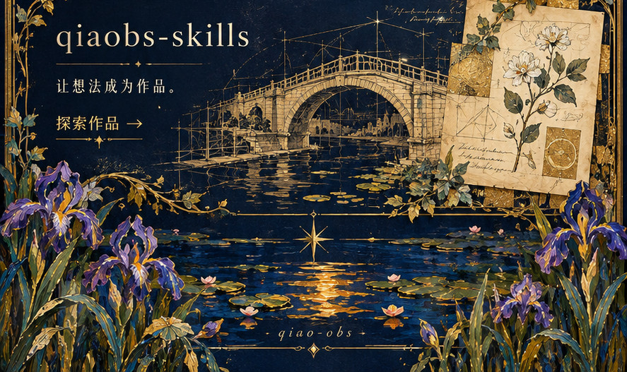

<picture><source type="image/avif" media="(prefers-reduced-motion: no-preference)" srcset="./assets/art/01-folio-hero.avif"></picture>
<picture><source type="image/avif" media="(prefers-reduced-motion: no-preference)" srcset="./assets/art/02-folio-studies.avif"></picture>
<a href="https://github.com/qiao-obs/qiaobs-skills"><picture><source type="image/avif" media="(prefers-reduced-motion: no-preference)" srcset="./assets/art/03-folio-project.avif"></picture></a>
<picture><source type="image/avif" media="(prefers-reduced-motion: no-preference)" srcset="./assets/art/04-gallery-paintings.avif"></picture>
<a href="https://github.com/qiao-obs/qiaobs-skills"><picture><source type="image/avif" media="(prefers-reduced-motion: no-preference)" srcset="./assets/art/05-gallery-project.avif"></picture></a>
<picture><source type="image/avif" media="(prefers-reduced-motion: no-preference)" srcset="./assets/art/06-nocturne-triptych.avif"></picture>
<a href="https://github.com/qiao-obs/qiaobs-skills"><picture><source type="image/avif" media="(prefers-reduced-motion: no-preference)" srcset="./assets/art/07-nocturne-project.avif"></picture></a>

向未知架桥，然后跨过去。&nbsp;·&nbsp; <a href="https://github.com/qiao-obs/qiaobs-skills">qiaobs-skills</a>&nbsp;·&nbsp; <a href="./assets/art/scroll.jpg">静态长卷</a>

