 

**向未知架桥，然后跨过去。**

I build agent workflows and full-stack systems — grounded in evidence, corrected by reality. 
我做 Agent 工作流与全栈工程。相信证据胜过直觉，让现实来修正判断。

 

<picture>
  <source media="(prefers-color-scheme: dark)" srcset="./assets/divider-01-dark.svg">
  
</picture>

 

`BUILDING ` 可验证的 Agent 工作流，把一次性的经验沉淀成可复用的 Skills 
`SHIPPING ` 全栈系统：模块化单体、任务队列、契约优先的 API 
`OBSERVING` 真实项目里第一处偏离预期的地方——那里通常藏着答案

> **FLIGHT RULES** 
> `TRACE  ` 先找到第一处偏差，再谈修复。 
> `EXECUTE` 在授权边界内连续推进，不在半路反复停下。 
> `UPDATE ` 让结果说话，现实与判断冲突时，改判断。

 

<picture>
  <source media="(prefers-color-scheme: dark)" srcset="./assets/divider-02-dark.svg">
  
</picture>

 

**[qiaobs-skills](https://github.com/qiao-obs/qiaobs-skills)** &nbsp;·&nbsp; 从真实项目中长出来的三套 Agent Skills &nbsp;·&nbsp; `TRACE` · `EXECUTE` · `UPDATE` &nbsp;·&nbsp; Python · MIT

 

<picture>
  <source media="(prefers-color-scheme: dark)" srcset="./assets/divider-03-dark.svg">
  
</picture>

 

 

OPEN CHANNEL &nbsp;·&nbsp; 有想法、发现问题，欢迎在 <a href="https://github.com/qiao-obs/qiaobs-skills/issues">Issues</a> 里呼叫地面站；觉得有用，点一颗 ⭐ 作为信标。

 

